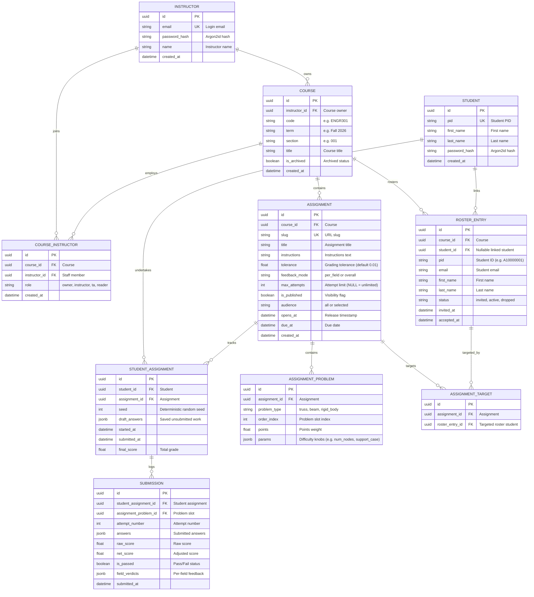

# Statics Platform — Backend Architecture & Guide

## 1. Executive Summary

This backend powers the web-based Statics Problem Platform designed to replace legacy MATLAB desktop applications for undergraduate engineering education.

Students solve randomized engineering mechanics problems directly in their web browsers without needing MATLAB installed. The backend synthesizes unique problem instances across multiple statics domains (including **2D Planar Trusses** and **2D Planar Rigid Bodies**), evaluates student answers server-side with numerical tolerances, and securely records attempts in an access-controlled database.

For instructors, the platform provides course management, batch roster CSV importing, teaching staff role assignment, and an assignment builder that lets professors configure variable numbers of problems ($1 \dots N$), select problem types, and tune difficulty knobs per problem slot.

---

## 2. Core Technologies Explained in Plain Terms

* **FastAPI (Python Web Server)**: The engine that listens for requests from the browser, runs our mechanics algorithms, and sends back problem diagrams and grading results.
* **Docker & Docker Compose**: Packages the Python code, dependencies, and database into isolated virtual containers. This ensures the application runs identically on any computer (Mac, Windows, Linux, or cloud servers) without configuration conflicts.
* **PostgreSQL (Database)**: A production-grade relational database where student accounts, course rosters, assignments, random problem seeds, and attempt logs are stored.
* **SQLAlchemy & Alembic (Database Manager & Migrations)**:
  * *SQLAlchemy* connects Python code to the database without requiring raw database query languages.
  * *Alembic* acts as version control for database tables, ensuring schema updates can be applied smoothly over time.
* **NumPy & SciPy (Numerical Physics Engine)**: Python scientific computing libraries that perform linear algebra operations, matrix solutions, and Delaunay geometry triangulation.

---

## 3. SOLID Design Principles (Why the Architecture Scales)

To prevent code duplication and maintenance challenges, this backend strictly follows the **SOLID** software engineering principles:

* **S — Single Responsibility Principle (SRP)**:
  * Every component has one, and only one, job.
  * `geometry.py` only creates joint coordinates and paths. `solver.py` only performs physics matrix algebra. `models.py` only defines database tables. `admin.py` and `student.py` handle HTTP routing and security.
* **O — Open-Closed Principle (OCP)**:
  * Open for extension, closed for modification.
  * When adding new problem types (such as Rigid Bodies, Beams, or Frames), we write a domain class implementing `ProblemGeneratorProtocol` and register it in `app/problems/__init__.py`. We **never** modify the web controllers, database schemas, or grading pipelines.
* **L — Liskov Substitution Principle (LSP)**:
  * Any specialized problem type can be swapped in without breaking the system.
  * Every problem domain implements `ProblemGeneratorProtocol`. Whether the system is handling a 3-joint Truss, an 8-joint Truss, or a Rigid Body with Pin and Roller supports, the API server interacts with them identically.
* **I — Interface Segregation Principle (ISP)**:
  * Components only rely on the specific interfaces they need.
  * The student presentation contract (`ProblemDisplayData`) is completely separated from the server-side grading solver (`solve`), ensuring zero solution leakage to the browser.
* **D — Dependency Inversion Principle (DIP)**:
  * Depend on high-level abstractions, not hardcoded concrete implementations.
  * The web routes depend on abstract protocols and database session interfaces (`AsyncSession`), not on specific database drivers or hardcoded problem files.

---

## 4. Problem Mechanics & Extensibility

### 1. Planar Truss Problem Domain
The 2D Truss problem generator follows classical structural analysis principles:
1. **Integer Coordinate Grid**: All joints/nodes lie on clean integer coordinates for ease of student calculation.
2. **Angle Invariant**: Internal member angles are strictly constrained to at least 30 to 45 degrees, preventing needle-thin or overlapping members.
3. **Simple Truss Determinacy**: Structural geometry enforces the planar simple truss formula:
   $$m = 2n - 3$$
   *(where $m$ is member count and $n$ is joint count)*.
   * $n = 3 \text{ joints} \implies m = 3 \text{ members}$
   * $n = 4 \text{ joints} \implies m = 5 \text{ members}$
   * $n = 5 \text{ joints} \implies m = 7 \text{ members}$
   * $n = 6 \text{ joints} \implies m = 9 \text{ members}$
   * $n = 7 \text{ joints} \implies m = 11 \text{ members}$
   * $n = 8 \text{ joints} \implies m = 13 \text{ members}$
4. **Support Boundary Conditions**: Pin and roller supports are placed on boundary joints with guaranteed moment arms, ensuring static determinacy (non-singular equilibrium matrix).
5. **Applied Point Loads**: Integer force magnitudes (1 to 5 kN) are applied strictly to unsupported joints.

### 2. 2D Rigid Body Equilibrium Problem Domain
The 2D Rigid Body generator synthesizes arbitrary continuous L-, T-, and multi-segment planar bodies on an integer Cartesian grid:
1. **Manhattan Random Walk & Node Collapse**:
   * A continuous path is generated via random walk steps ($\pm 1$ in X or Y).
   * Overlapping nodes are collapsed, tracking 4-directional neighborhood flags ($+x, +y, -x, -y$) for drawing clearance.
2. **Three Boundary Support Configurations**:
   * **Case 1 (3 Rollers)**: Non-parallel, non-collinear rollers providing 3 independent normal reaction forces.
   * **Case 2 (1 Pin + 1 Roller - Default)**: Fixed pin at support $A$ (reactions $A_x, A_y$) and roller at support $B$ (reaction $B_x$ or $B_y$), enforcing non-zero moment arms ($\Delta x \ne 0$ for vertical rollers, $\Delta y \ne 0$ for horizontal rollers).
   * **Case 3 (1 Fixed Cantilever Wall)**: Wall support fixed at a dead-end terminal node, providing horizontal reaction $A_x$, vertical reaction $A_y$, and reaction couple moment $M_A$.
3. **Applied External Loads**:
   * **Point Loads**: Whole integer forces $1 \dots 5\text{ kN}$ directed along $\pm \hat{i}$ or $\pm \hat{j}$.
   * **Couple Moments**: Concentrated moments $1 \dots 5\text{ kN}\cdot\text{m}$ ($M \cdot Fa$), counterclockwise ($+1$) or clockwise ($-1$).
4. **Physics Matrix Solver**:
   Global static equilibrium equations are formulated and solved:
   $$\sum F_x = 0 \implies F_{Rx} = -\sum F_{x, \text{ext}}$$
   $$\sum F_y = 0 \implies F_{Ry} = -\sum F_{y, \text{ext}}$$
   $$\sum M_O = 0 \implies M_{RO} = -\sum (\vec{r} \times \vec{F})_{\text{ext}} - \sum M_{\text{ext}}$$
   Solved via the linear system $\mathbf{A} \vec{x} = \vec{b}$ for unknown support reactions.

### Configurable Difficulty Knobs
Each problem generator declares its own parameter schema (`params_schema`), allowing the Assignment Builder UI to dynamically render sliders and dropdowns without hardcoding domain details:
* **Planar Truss**: `num_nodes` (joint count), `max_force` (maximum load in kN), `load_count` (number of applied loads).
* **2D Rigid Body**: `support_case` (1: 3 Rollers, 2: Pin + Roller, 3: Wall), `num_loads` (number of point forces), `num_moments` (number of concentrated moments), `max_force` (maximum force magnitude).
* **Beam (Upcoming)**: `span_length` (length of beam), `load_type` (point loads vs distributed loads).

---

## 5. Database Schema & Entity Relationships



---

## 6. End-to-End User Workflows

### 1. Instructor Course & Roster Management
1. **Course Setup**: The instructor creates a course (e.g., `ENGR301`, `Fall 2026`). The creator is automatically assigned the `owner` role in `course_instructors`.
2. **Staff Invitation**: The instructor can add colleagues or TAs by email with specific permission levels (`instructor`, `ta`, `reader`).
3. **Roster CSV Import**: The instructor pastes CSV data containing student PIDs, emails, and names:
   ```text
   A10000001, alice@university.edu, Alice, Smith
   A10000002, bob@university.edu, Bob, Jones
   ```
   * The backend validates rows, skips duplicates, and creates `RosterEntry` records with status `"invited"`.
   * If a student already has an account, it is immediately linked (`student_id = student.id`). Otherwise, it remains ready for automatic linking when the student registers.

### 2. Assignment Builder & Problem Configuration
1. **Assignment Creation**: The instructor creates an assignment with custom instructions, due dates, grading tolerances (e.g. $\pm 1\%$), and attempt limits.
2. **Variable Problem Slots**: The instructor adds any number of problems ($1 \dots N$). Each problem slot can be a different problem domain (Truss, Rigid Body, Beam) with custom difficulty knobs and points weighting.
3. **Presets & Difficulty Ramps**: The instructor can select difficulty presets or customize each slot individually.
4. **Zero-Leakage Preview**: The instructor clicks "Preview" on any problem slot to inspect the SVG rendering and student prompt with randomized seeds, while solution data remains strictly protected.
5. **Publishing**: The instructor toggles "Publish" (prevented if the assignment contains 0 problems).

### 3. Student Registration & Homework Solving
1. **Account Registration**: A student registers with their university PID (`A10000001`) and a secure password (minimum 8 characters).
2. **Auto-Linking**: The registration endpoint automatically finds all unlinked roster entries matching the student's PID and links them to the new account.
3. **Course Invitations**: The student visits their dashboard and sees pending invitations for courses they were rostered in.
4. **Accepting Invitations**: Clicking "Accept" updates the roster entry status to `"active"` and reveals the course's published assignments.
5. **Interactive Solving & Instant Grading**:
   * Opening an assignment assigns an immutable random seed to the student.
   * Each problem slot generates unique geometry from that seed.
   * The student calculates reaction forces/moments or member forces and submits answers.
   * The backend solver calculates exact ground truth on-the-fly, evaluates answers within the configured tolerance, records the attempt log, and provides instant feedback.

---

## 7. How to Run the Application Locally

### Option A: Using Docker (Recommended)

1. **Start the database and backend**:
   ```bash
   docker compose up -d
   ```
2. **Apply database migrations**:
   ```bash
   docker compose run --rm backend alembic upgrade head
   ```
3. **Seed initial demonstration data**:
   ```bash
   docker compose run --rm backend python -m app.scripts.seed
   ```
4. **Start the frontend**:
   ```bash
   cd frontend
   npm run dev
   ```
5. Open your browser to **`http://localhost:5173`**.

---

### Option B: Running Backend Locally with Python Virtual Environment

1. **Activate virtual environment**:
   ```powershell
   cd backend
   .\venv\Scripts\Activate.ps1
   ```
2. **Install dependencies**:
   ```powershell
   pip install -e ".[dev]"
   ```
3. **Run unit & integration tests**:
   ```powershell
   pytest
   ```
4. **Run code quality and type checks**:
   ```powershell
   ruff check app tests
   mypy --strict app tests
   ```

---

## 8. Default Seed Credentials for Testing

* **Instructor Portal**:
  * URL: `http://localhost:5173/admin/login`
  * Email: `marko@university.edu`
  * Password: `statics2026`
* **Student Portal**:
  * URL: `http://localhost:5173/student/login`
  * PID: `demo001`
  * Password: `demo1234`
