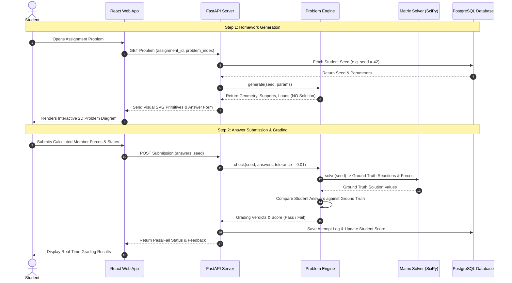
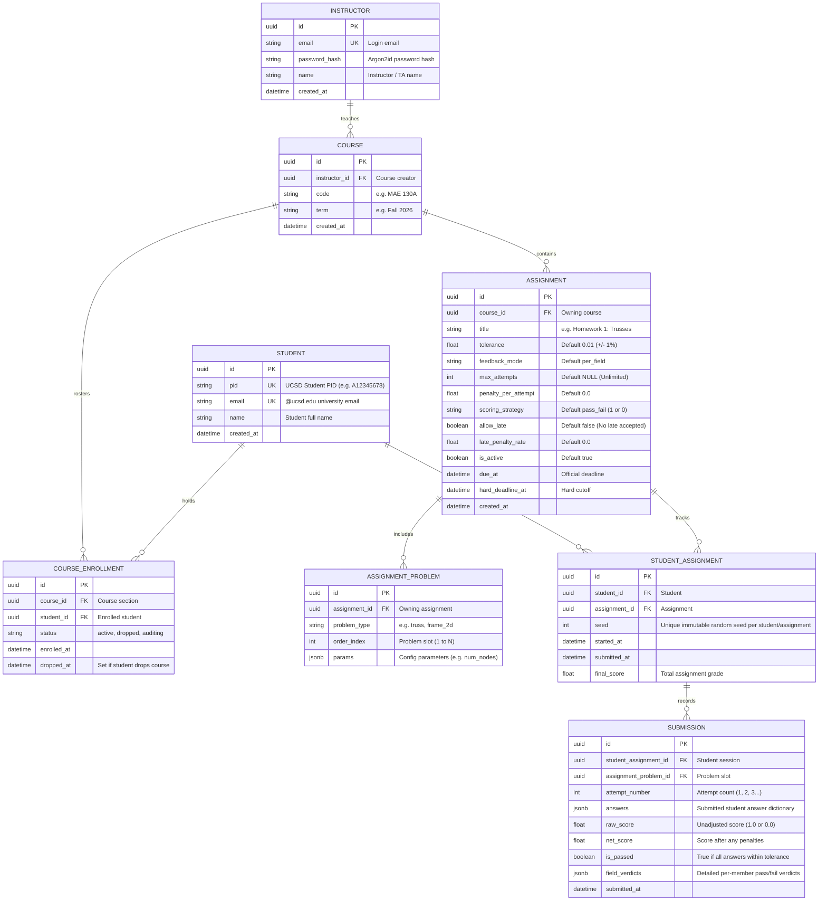
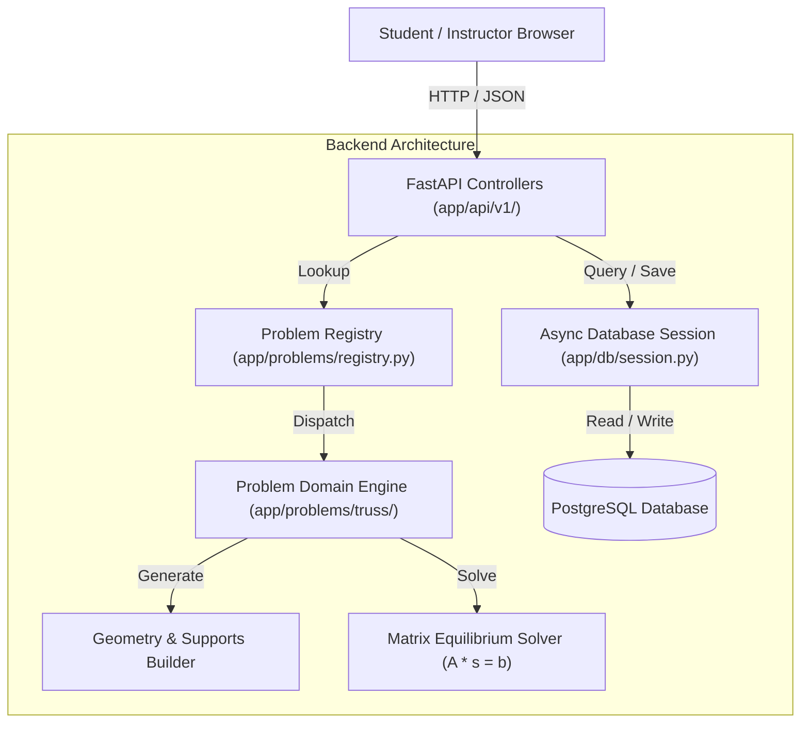

# Statics Platform — Backend Architecture & Guide

## 1. Executive Summary

This backend powers the web-based Statics Problem Platform designed to replace legacy MATLAB desktop applications for engineering education. 

Students access homework problems directly in their web browser without installing MATLAB. The backend dynamically synthesizes randomized statics problems (starting with 2D Trusses, and extensible to Rigid Bodies, Frames, and Beams), evaluates student answers server-side with numerical tolerances, and securely records attempts in an access-controlled database.

---

## 2. Core Technologies Explained in Plain Terms

* **FastAPI (Python Web Server)**: The engine that listens for requests from the browser, runs our mechanics algorithms, and sends back problem diagrams and grading results.
* **Docker & Docker Compose**: Packages the Python code, dependencies, and database into isolated virtual containers. This ensures the application runs identically on any computer (Mac, Windows, Linux, or cloud servers) without configuration conflicts.
* **PostgreSQL (Database)**: A relational database where student accounts, assignments, random problem seeds, and attempt logs are stored.
* **SQLAlchemy & Alembic (Database Manager & Migrations)**:
  * *SQLAlchemy* connects Python code to the database without requiring raw database query languages.
  * *Alembic* acts as version control for database tables, ensuring schema updates can be applied smoothly over time.
* **NumPy & SciPy (Numerical Physics Engine)**: Python scientific computing libraries that perform linear algebra operations, matrix solutions, and Delaunay geometry triangulation.

---

## 3. SOLID Design Principles (Why the Architecture Scales)

To prevent the code duplication and maintenance challenges of the legacy MATLAB desktop apps, this backend strictly follows the **SOLID** software engineering principles:

* **S — Single Responsibility Principle (SRP)**:
  * *Concept*: Every component has one, and only one, job.
  * *In our code*: `geometry.py` only creates joint coordinates and triangles. `solver.py` only performs physics matrix algebra. `models.py` only defines database tables. No single file tries to do everything.
* **O — Open-Closed Principle (OCP)**:
  * *Concept*: Open for extension, closed for modification.
  * *In our code*: When adding future problem types (such as 2D Frames, Beams, or Centroids), we simply write one new domain class and register it with `ProblemRegistry`. We **never** need to modify the web controllers, database schemas, or grading pipelines.
* **L — Liskov Substitution Principle (LSP)**:
  * *Concept*: Any specialized component can be swapped in without breaking the system.
  * *In our code*: Every problem domain implements `ProblemGeneratorProtocol`. Whether the system is handling a 3-node Truss or a future 10-node Frame, the API server interacts with them identically.
* **I — Interface Segregation Principle (ISP)**:
  * *Concept*: Components only rely on the specific methods they need.
  * *In our code*: The student presentation contract (`ProblemDisplayData`) is completely separated from the server-side grading solver (`solve`), ensuring zero solution leakage to the browser.
* **D — Dependency Inversion Principle (DIP)**:
  * *Concept*: Depend on high-level abstractions, not hardcoded concrete implementations.
  * *In our code*: The web routes depend on abstract protocols and database session interfaces (`AsyncSession`), not on specific database drivers or hardcoded problem files.

---

## 4. How a Statics Problem Works (Workflow Diagram)




---

## 5. Mechanics Generation & Equilibrium Rules

The 2D Truss problem generator follows classical structural analysis principles:
1. **Integer Coordinate Grid**: All joints/nodes lie on clean integer coordinates for ease of student calculation.
2. **Angle Invariant**: Internal member angles are strictly constrained to at least 45 degrees, preventing needle-thin or overlapping members.
3. **Simple Truss Determinacy**: Structural geometry enforces the planar simple truss formula:
   $$m = 2n - 3$$
   *(where $m$ is member count and $n$ is joint count)*.
4. **Support Boundary Conditions**: Pin and roller supports are placed on boundary joints with guaranteed moment arms, ensuring static determinacy (non-singular equilibrium matrix).
5. **Applied Point Loads**: Integer force magnitudes (1 to 5 kN) are applied strictly to unsupported upper joints.

---

## 6. Database Schema & Entity Relationships

The database maintains strict separation between course administration and problem mechanics. The Entity-Relationship diagram below illustrates how all records link together:



---

## 7. Architecture & File Structure



### Directory Layout

```
backend/
├── alembic/                 # Database schema migration scripts
├── app/
│   ├── api/v1/              # Web route controllers (health, problems, assignments)
│   ├── core/                # Configuration and environment settings
│   ├── db/                  # Database session and SQLAlchemy table models
│   │   ├── session.py       # Async engine & get_db dependency
│   │   └── models.py        # Relational ORM models
│   └── problems/            # Mechanics domain engine
│       ├── base.py          # Unified problem generator interface protocol
│       ├── registry.py      # Dynamic problem type registry
│       └── truss/           # 2D Truss generator, geometry, supports, loads, solver
│           ├── generator.py # TrussGenerator implementing protocol
│           ├── geometry.py  # Delaunay triangulation & angle checks
│           ├── supports.py  # Pin & roller support placement
│           ├── loads.py     # External point force generator
│           └── solver.py    # Reactions & member forces linear solvers
├── tests/                   # Automated test suite (physics, database, API routes)
├── Dockerfile               # Container build blueprint
└── pyproject.toml           # Python dependency and build configuration
```

---

## 8. How to Run and Test the Backend (Step-by-Step Guide)


You do not need prior software engineering experience or Python installations on your computer to run and test this backend. Docker manages all dependencies automatically.

---

### Step 1: Ensure Docker Desktop is Running
1. Open the **Docker Desktop** application from your Applications or Start Menu.
2. Wait a few seconds until the status in the bottom-left corner turns green and indicates **"Engine running"**.

---

### Step 2: Start the Backend Server
Open your terminal (PowerShell on Windows or Terminal on Mac) in the project directory and run:

```bash
docker compose up backend postgres
```

What happens:
* Starts the PostgreSQL database container.
* Starts the FastAPI backend server with live auto-reloading.

---

### Step 3: Test and Generate Problems in Your Web Browser
Once the backend is running, open your web browser (Chrome, Safari, Edge, or Firefox) and navigate to:

**`http://localhost:8000/api/docs`**

This opens an interactive graphical testing dashboard (Swagger UI):
1. Scroll to the **`problems`** section.
2. Click on **`POST /api/v1/problems/{problem_type}/generate`**.
3. Click the white **Try it out** button on the right.
4. Set `problem_type` to: `truss`
5. In the request body text box, enter:
   ```json
   {
     "seed": 42
   }
   ```
6. Click the blue **Execute** button.
7. Under **Server response (Code 200)**, you will see the generated structural geometry (joints, member connections, pin/roller supports, and downward point loads).

---

### Step 4: Run the Complete Automated Verification Test Suite
To verify that all physics math, database operations, and API endpoints are working correctly without starting the browser, open a new terminal window and run:

```bash
docker compose run --rm backend pytest -v
```

What this test suite verifies:
* **Physics & Solvability (`test_problems.py`)**: Tests 40+ random seeds to verify that joint equilibrium equations ($\sum F_x = 0, \sum F_y = 0, \sum M = 0$), matrix solver calculations, minimum $45^\circ$ angles, integer coordinates, and $m = 2n - 3$ determinacy are 100% mathematically correct.
* **Security & Invariants**: Confirms that internal reaction forces and member answers are never leaked in student-facing payloads.
* **Database & Enrollments (`test_db.py`)**: Verifies that instructors, student rosters, courses, assignment problem slots, student seeds, and attempt logs persist correctly.
* **API Endpoints (`test_api_problems.py`)**: Verifies that the web server answers generation and grading requests properly.

A green `PASSED` next to every test confirms that the backend is fully verified and ready.

---

### Step 5: How to Stop the Backend
When you are finished testing, return to the terminal where the server is running and press **`Ctrl + C`** on your keyboard to shut down the containers cleanly.
